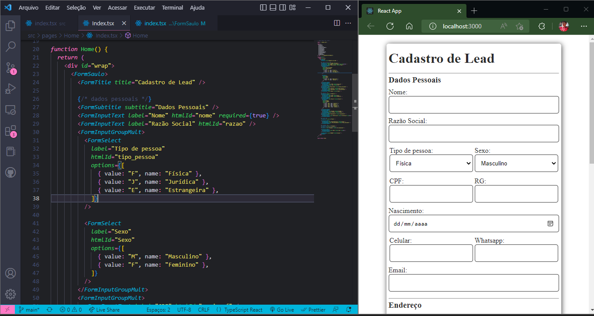

# lib-form-reactjs-ts



## Form Elements

### FormSaulo

```jsx
export function FormSaulo({ children }: { children: React.ReactNode }) {
  return <form className="FormSaulo">{children}</form>;
}
```

```jsx
<FormSaulo>
    /* html */
</FormSaulo>
```

<hr>

### FormTitle

```jsx
export function FormTitle({ title = "no title" }: { title?: string }) {
  return <h1 className="tit">{title}</h1>;
}
```

```jsx
<FormTitle title="Título do Formulário" />
```

<hr>

### FormSubtitle

```jsx
export function FormSubtitle({
  subtitle = "no subtitle",
}: {
  subtitle?: string;
}) {
  return (
    <>
      <hr className="divisor" />
      <h3 className="sub" id="dados_pessoais">
        {subtitle}
      </h3>
    </>
  );
}
```

```jsx
<FormSubtitle subtitle="Subtítulo do formulário" />
```

<hr>

### FormInputGroupMult

```jsx
export function FormInputGroupMult({
  children,
}: {
  children: React.ReactNode;
}) {
  return <div className="input_g_mult">{children}</div>;
}
```

```jsx
<FormInputGroupMult>
    /* html */
</FormInputGroupMult>
```

<hr>

### FormInputText

```jsx

```

```jsx

```

<hr>

### FormInputDate

```jsx

```

```jsx

```

<hr>

### FormInputEmail

```jsx

```

```jsx

```

<hr>

### FormInputTel

```jsx

```

```jsx

```

<hr>

### FormInputTextArea

```jsx

```

```jsx

```

<hr>

### FormInputNumber

```jsx

```

```jsx

```

<hr>

### FormSelect

```jsx

```

```jsx

```

<hr>

### FormBtnSubmit

```jsx

```
